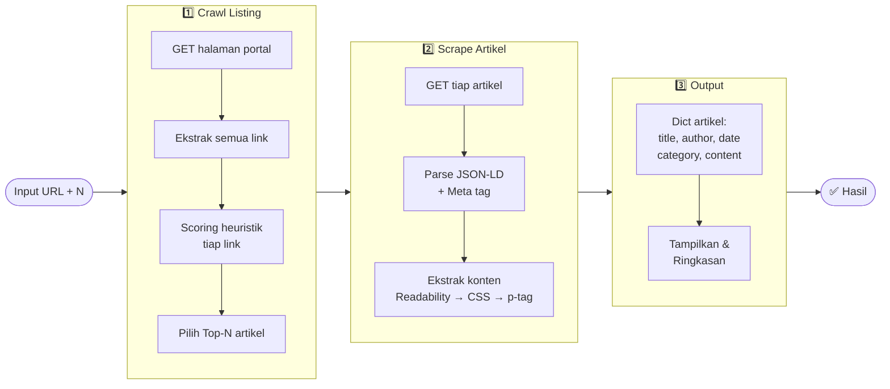
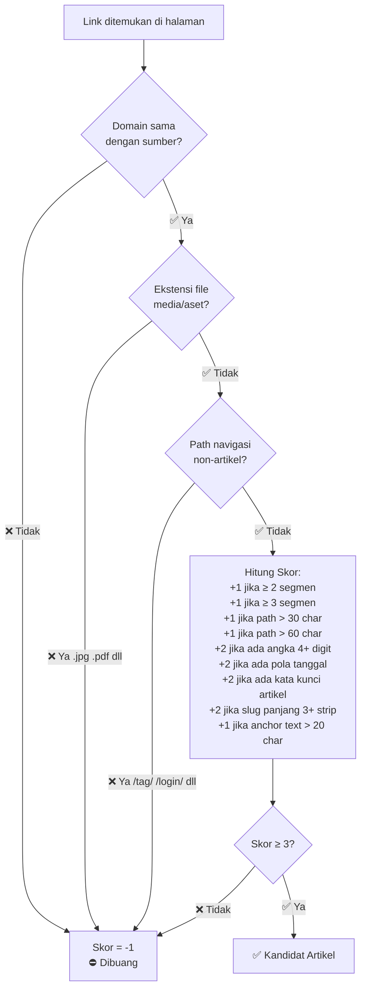
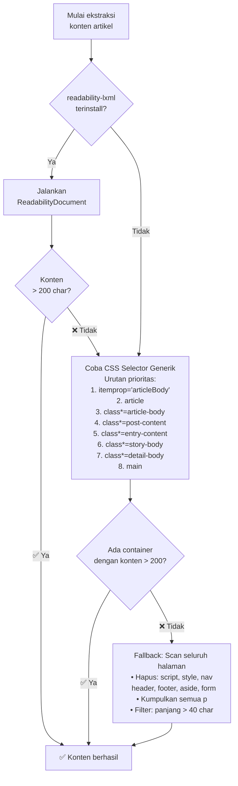

# 📊 Block Diagram — Universal News Scraper

## Alur Lengkap Sistem

```mermaid
flowchart TD
    START([" 🚀 START\nInput: URL Portal + Jumlah Artikel"])

    %% ═══════════════════════════════
    %% TAHAP 1 — CRAWL LISTING
    %% ═══════════════════════════════
    subgraph LISTING["🔍 TAHAP 1 — CRAWL LISTING  (crawl_listing)"]
        L1["fetch_html\nGET halaman portal / listing"]
        L2{"Berhasil\nmendapat HTML?"}
        L3["BeautifulSoup\nParse HTML"]
        L4["Ekstrak semua tag\n&lt;a href&gt; di halaman"]
        L5["urljoin → normalisasi URL\nbuang fragment #"]
        L6["_score_link\nHitung skor heuristik tiap link"]
        L7{"Skor ≥ 3?"}
        L8["Tambah ke kandidat artikel"]
        L9["Lewati link ini"]
        L10["Sort by skor tertinggi\nAmbil N link teratas"]
        L_FAIL(["❌ Return list kosong"])
    end

    %% ═══════════════════════════════
    %% SCORING DETAIL
    %% ═══════════════════════════════
    subgraph SCORING["📐 _score_link — Sistem Scoring Heuristik"]
        direction TB
        S1{"Domain sama\ndengan sumber?"}
        S2{"Ada ekstensi\nmedia / aset?"}
        S3{"Path mengandung\nnavigasi bukan artikel?"}
        S4["Tambah poin:\n✦ Path ≥ 2 segmen → +1\n✦ Path ≥ 3 segmen → +1\n✦ Panjang path &gt; 30 → +1\n✦ Panjang path &gt; 60 → +1\n✦ Ada angka ≥ 4 digit → +2\n✦ Pola tanggal /YYYY/MM/ → +2\n✦ Kata kunci artikel → +2\n✦ Slug ≥ 3 tanda hubung → +2\n✦ Anchor text &gt; 20 char → +1"]
        S_SKIP(["Return -1\n❌ Bukan artikel"])
    end

    %% ═══════════════════════════════
    %% TAHAP 2 — SCRAPE ARTIKEL
    %% ═══════════════════════════════
    subgraph SCRAPE["📄 TAHAP 2 — SCRAPE ARTIKEL  (scrape_article)"]
        direction TB
        A1["fetch_html\nGET halaman artikel"]
        A2{"Berhasil\nmendapat HTML?"}
        A3["BeautifulSoup\nParse HTML"]
        A4["_parse_jsonld\nEkstrak JSON-LD structured data"]

        subgraph META["📋 Ekstraksi Metadata"]
            direction LR
            M1["_extract_title\nog:title → JSON-LD headline → h1 → title"]
            M2["_extract_author\nmeta author → JSON-LD → class*author"]
            M3["_extract_date\narticle:published_time → JSON-LD → time tag"]
            M4["_extract_category\narticle:section → JSON-LD → breadcrumb"]
        end

        subgraph CONTENT["📝 Ekstraksi Konten (_extract_content)"]
            direction TB
            C1{"readability-lxml\ntersedia?"}
            C2["Readability\nAlgoritma Mozilla"]
            C3{"Konten\n&gt; 200 karakter?"}
            C4["CSS Selector Generik\narticleBody → article → article-body\npost-content → entry-content → main"]
            C5{"Konten\n&gt; 200 karakter?"}
            C6["Fallback: Kumpulkan semua &lt;p&gt;\nHapus: script, nav, header, footer\nFilter: panjang &gt; 40 karakter"]
        end

        A5["clean_text\nNormalisasi whitespace & baris kosong"]
        A6["Hitung word_count"]
        A7["Delay DELAY_DETIK detik\nsebelum request berikutnya"]
        A_FAIL(["❌ Return dict kosong\n(konten tidak tersedia)"])
    end

    %% ═══════════════════════════════
    %% TAHAP 3 — OUTPUT
    %% ═══════════════════════════════
    subgraph OUTPUT["📦 TAHAP 3 — OUTPUT"]
        O1["Kumpulkan semua dict artikel"]
        O2["print_article\nTampilkan detail tiap artikel"]
        O3["print_ringkasan\nTampilkan tabel ringkasan akhir"]
        O4[["📋 Struktur Output per Artikel:\n──────────────────────\nurl, domain, title\nauthor, date, category\ncontent, word_count\nscraped_at"]]
    end

    END([" ✅ SELESAI"])

    %% ═══════════════════════════════
    %% KONEKSI ANTAR NODE
    %% ═══════════════════════════════

    START --> L1
    L1 --> L2
    L2 -- "Gagal" --> L_FAIL
    L2 -- "OK" --> L3
    L3 --> L4
    L4 --> L5
    L5 --> L6
    L6 --> SCORING
    SCORING --> L7
    S1 -- "Tidak" --> S_SKIP
    S1 -- "Ya" --> S2
    S2 -- "Ya .jpg .pdf dll" --> S_SKIP
    S2 -- "Tidak" --> S3
    S3 -- "Ya /tag/ /kategori/ dll" --> S_SKIP
    S3 -- "Tidak" --> S4
    L7 -- "Ya" --> L8
    L7 -- "Tidak" --> L9
    L8 --> L10
    L9 --> L4
    L10 --> A1

    A1 --> A2
    A2 -- "Gagal" --> A_FAIL
    A2 -- "OK" --> A3
    A3 --> A4
    A4 --> META
    META --> CONTENT
    C1 -- "Ya" --> C2
    C2 --> C3
    C3 -- "Ya" --> A5
    C3 -- "Tidak" --> C4
    C1 -- "Tidak" --> C4
    C4 --> C5
    C5 -- "Ya" --> A5
    C5 -- "Tidak" --> C6
    C6 --> A5
    A5 --> A6
    A6 --> A7
    A7 --> O1

    O1 --> O2
    O2 --> O3
    O3 --> O4
    O4 --> END

    %% ═══════════════════════════════
    %% STYLING
    %% ═══════════════════════════════
    classDef startEnd fill:#6366f1,stroke:#4338ca,color:#fff,rx:20
    classDef process fill:#1e293b,stroke:#334155,color:#e2e8f0
    classDef decision fill:#0f172a,stroke:#6366f1,color:#a5b4fc
    classDef fail fill:#450a0a,stroke:#dc2626,color:#fca5a5
    classDef output fill:#052e16,stroke:#16a34a,color:#86efac
    classDef subproc fill:#1e1b4b,stroke:#818cf8,color:#c7d2fe

    class START,END startEnd
    class L1,L3,L4,L5,L6,L8,L9,L10 process
    class A1,A3,A4,A5,A6,A7 process
    class M1,M2,M3,M4 subproc
    class C2,C4,C6 subproc
    class S4 subproc
    class L2,A2,L7,C1,C3,C5,S1,S2,S3 decision
    class L_FAIL,A_FAIL,S_SKIP fail
    class O1,O2,O3,O4 output
```

---

## Diagram Ringkas (Overview)

```mermaid
flowchart LR
    IN([" Input URL + N "])

    subgraph P1["1️⃣  Crawl Listing"]
        direction TB
        p1a["GET halaman portal"]
        p1b["Ekstrak semua link"]
        p1c["Scoring heuristik\ntiap link"]
        p1d["Pilih Top-N artikel"]
        p1a --> p1b --> p1c --> p1d
    end

    subgraph P2["2️⃣  Scrape Artikel"]
        direction TB
        p2a["GET tiap artikel"]
        p2b["Parse JSON-LD\n+ Meta tag"]
        p2c["Ekstrak konten\nReadability → CSS → p-tag"]
        p2a --> p2b --> p2c
    end

    subgraph P3["3️⃣  Output"]
        direction TB
        p3a["Dict artikel:\ntitle, author, date\ncategory, content"]
        p3b["Tampilkan &\nRingkasan"]
        p3a --> p3b
    end

    IN --> P1 --> P2 --> P3 --> OUT([" ✅ Hasil "])
```

---

## Detail Scoring Link

```mermaid
flowchart TD
    L["Link ditemukan di halaman"]

    L --> D1{"Domain sama\ndengan sumber?"}
    D1 -- "❌ Tidak" --> SKIP["Skor = -1\n⛔ Dibuang"]
    D1 -- "✅ Ya" --> D2

    D2{"Ekstensi file\nmedia/aset?"}
    D2 -- "❌ Ya .jpg .pdf dll" --> SKIP
    D2 -- "✅ Tidak" --> D3

    D3{"Path navigasi\nnon-artikel?"}
    D3 -- "❌ Ya /tag/ /login/ dll" --> SKIP
    D3 -- "✅ Tidak" --> SCORE

    SCORE["Hitung Skor:\n+1 jika ≥ 2 segmen\n+1 jika ≥ 3 segmen\n+1 jika path > 30 char\n+1 jika path > 60 char\n+2 jika ada angka 4+ digit\n+2 jika ada pola tanggal\n+2 jika ada kata kunci artikel\n+2 jika slug panjang 3+ strip\n+1 jika anchor text > 20 char"]

    SCORE --> D4{"Skor ≥ 3?"}
    D4 -- "✅ Ya" --> OK["✅ Kandidat Artikel"]
    D4 -- "❌ Tidak" --> SKIP
```

---

## Strategi Ekstraksi Konten

```mermaid
flowchart TD
    START["Mulai ekstraksi\nkonten artikel"]

    START --> R1{"readability-lxml\nterinstall?"}
    R1 -- "Ya" --> R2["Jalankan\nReadabilityDocument"]
    R2 --> R3{"Konten\n> 200 char?"}
    R3 -- "✅ Ya" --> DONE["✅ Konten berhasil"]
    R3 -- "❌ Tidak" --> CSS

    R1 -- "Tidak" --> CSS

    CSS["Coba CSS Selector Generik\nUrutan prioritas:\n1. itemprop='articleBody'\n2. article\n3. class*=article-body\n4. class*=post-content\n5. class*=entry-content\n6. class*=story-body\n7. class*=detail-body\n8. main"]
    CSS --> CSS2{"Ada container\ndengan konten > 200?"}
    CSS2 -- "✅ Ya" --> DONE
    CSS2 -- "❌ Tidak" --> FB

    FB["Fallback: Scan seluruh halaman\n• Hapus: script, style, nav\n  header, footer, aside, form\n• Kumpulkan semua p\n• Filter: panjang > 40 char"]
    FB --> DONE
```
